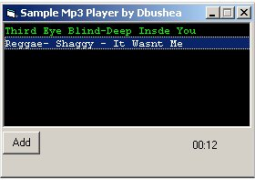



## Sample mp3 player

### Description

Shows you how to use the Common Dialog Control and Microsoft Media Player control to select and play mp3's. Works in the sort of manner as WinAmp, also puts the time elapsed in 00:00 format.
 
### More Info
 
Dangerously Cool!

             |
---                |---
**Submitted On**   |2001-04-14 21:39:12
**By**             |[Dave Bushea](https://github.com/Planet-Source-Code/PSCIndex/blob/master/ByAuthor/dave-bushea.md)
**Level**          |Beginner
**User Rating**    |4.0 (12 globes from 3 users)
**Compatibility**  |VB 4\.0 \(32\-bit\), VB 5\.0, VB 6\.0
**Category**       |[Sound/MP3](https://github.com/Planet-Source-Code/PSCIndex/blob/master/ByCategory/sound-mp3__1-45.md)
**World**          |[Visual Basic](https://github.com/Planet-Source-Code/PSCIndex/blob/master/ByWorld/visual-basic.md)
**Archive File**   |[Sample mp3183904142001\.zip](https://github.com/Planet-Source-Code/dave-bushea-sample-mp3-player__1-22414/archive/master.zip)

